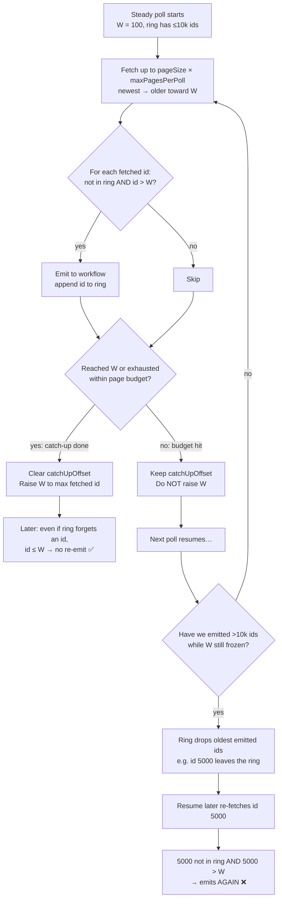

<!-- IMPL-REVIEW-REPORT -->
# Implementation Review: Nextcloud News Trigger Simplification

- **Plan**: `context/changes/nextcloud-news/plan-reapproach.md`
- **Scope**: Phases 1–3 of 3 (full plan)
- **Date**: 2026-07-21
- **Verdict**: NEEDS ATTENTION
- **Findings**: 0 critical, 2 warnings, 3 observations

## Verdicts

| Dimension | Verdict |
|-----------|---------|
| Plan Adherence | PASS |
| Scope Discipline | PASS |
| Safety & Quality | WARNING |
| Architecture | PASS |
| Pattern Consistency | PASS |
| Success Criteria | PASS |

## Findings

### F1 — Unbounded pageSize / maxPagesPerPoll

- **Severity**: ⚠️ WARNING
- **Impact**: 🔎 MEDIUM — real tradeoff; pause to reason through it
- **Dimension**: Safety & Quality
- **Location**: `nodes/NextcloudNewsTrigger/NextcloudNewsTrigger.node.ts:99-117`, `pollNews.ts:79-102`, `pollNews.ts:74-76` / `424-426`
- **Detail**: Plan added configurable bounds with defaults 100/5 and `minValue: 1`, but no upper clamp. Operators (or bad expressions) can set huge `pageSize` (memory/latency) or huge `maxPagesPerPoll` (API hammering). Tiny `pageSize` also explodes seed work via `seedMaxPagesForPageSize = ceil(10000 / pageSize)` (up to 10k sequential GETs on activation).
- **Fix A ⭐ Recommended**: Add `maxValue` on both node params and clamp in `resolveNewsPollLimits` / seed helper (e.g. pageSize ≤ 200, maxPagesPerPoll ≤ 20, seed pages hard-capped independently).
  - Strength: Matches “safe numeric constraints” intent in Phase 2; closes DoS-by-config without changing defaults.
  - Tradeoff: Picks arbitrary caps; high-volume operators may need docs to raise carefully.
  - Confidence: HIGH — UI `typeOptions.maxValue` + runtime clamp is the existing n8n pattern.
  - Blind spot: Exact News API max batchSize not re-verified against live docs in this review.
- **Fix B**: Document only (node description + next-app-triggers) and leave uncapped.
  - Strength: Zero code risk; preserves full operator freedom.
  - Tradeoff: Misconfiguration still hurts activation/runtime.
  - Confidence: MEDIUM — relies on operators reading help text.
  - Blind spot: Expression-driven params bypass “I typed carefully in UI” assumptions.
- **Decision**: Fixed via Fix B — document only; upper bounds left to Nextcloud News server / operator

- **Severity**: ⚠️ WARNING
- **Impact**: 🔬 HIGH — architectural stakes; think carefully before deciding
- **Dimension**: Safety & Quality
- **Location**: `nodes/NextcloudNewsTrigger/pollNews.ts:680-691` (with ring at `677`, catch-up budget at `475-488`)
- **Detail**: While `catchUpOffset` is set, `maxProcessedId` is intentionally not raised (no permanent skip). Fetched ids still enter the ring and may emit (`id > watermark`). If backlog stays above `pageSize × maxPagesPerPoll` for many polls, catch-up may never reach W; after `processedIds` exceeds 10 000, earlier mid-catch-up ids are evicted. A later resume re-fetch of those ids is again “unseen” and still `> W`, so they can fire twice. Continuous newest-burst peeks amplify lag. This is a design edge case of delayed-W + bounded ring, not a Phase 1 B1 regression (B1 itself matches plan).

#### F2 explained (why this can happen)

Two stores decide “have we seen this article?”:

| Store | Role | Durable across long catch-up? |
|-------|------|-------------------------------|
| **Watermark** (`maxProcessedId`) | Authoritative “already accounted for” boundary; emit only if `id > W` | Yes — but **frozen** until catch-up finishes (so mid-burst older pages are not skipped) |
| **Ring** (`processedIds`, max 10 000) | In-poll / short-window dedupe | No — oldest ids fall off once >10k new ids are recorded |

Normal case (burst finishes within a few polls): catch-up reaches W → W jumps to the newest fetched id → even if the ring later forgets an id, `id > W` is false → no re-fire.

Pathological case (backlog keeps growing faster than one poll can walk): catch-up never completes → W stays old → ring is the *only* dedupe for already-emitted ids → after 10k+ emits, ring forgets early ids → resume re-fetches them → they look “new” again.

Concrete numbers (defaults `pageSize=100`, `maxPagesPerPoll=5` → 500 articles/poll):

1. W=100. Overnight, 12 000 new articles appear (ids 101…12 100).
2. Polls 1–20: each emits ~500 ids, ring fills, W still 100 because catch-up has not walked all the way back to 100.
3. Once ring holds 10 000 ids, older ones (e.g. early 101…) are evicted.
4. A later resume page that includes those evicted ids treats them as unseen and `> W` → duplicate workflow runs.

How rare? Only when **incomplete catch-up lasts long enough to exceed the 10k ring** (huge sustained backlog, or limits set so low that catch-up never catches the ingest rate). Typical feeds never hit this.

- **Fix A ⭐ Recommended**: Track emitted ids (or an “emitted high-water”) that survives ring eviction until catch-up completes and W advances; add a >10k multi-poll regression test.
  - Strength: Preserves no-skip catch-up while closing the re-fire path under extreme backlog.
  - Tradeoff: Extra static-data key / logic; more state to reason about.
  - Confidence: MEDIUM — needs careful interaction with existing ring + W rules.
  - Blind spot: How often real feeds exceed 10k ids while catch-up never completes is unverified.
- **Fix B**: Document as known limitation; rely on operators raising limits / shortening poll interval; optionally emit a one-shot notice after N incomplete catch-up polls.
  - Strength: No state-model change; matches “bounded catch-up” product framing.
  - Tradeoff: Extreme backlog still risks duplicates; notice-only doesn’t prevent re-fire.
  - Confidence: MEDIUM — acceptable if extreme backlog is rare.
  - Blind spot: No production telemetry on catch-up duration.
- **Decision**: Fixed via Fix B — document known limitation; operator maintains poll capacity vs ingest rate

### F3 — pollError notice shares the article output stream

- **Severity**: 👁️ OBSERVATION
- **Impact**: 🏃 LOW — quick decision; fix is obvious and narrowly scoped
- **Dimension**: Pattern Consistency
- **Location**: `nodes/shared/pollOrchestration.ts:111-114`, wired at `pollNews.ts:650-654`
- **Detail**: Intentional `oneShotNotice` emits `{ event: 'pollError', message }` on the main trigger branch. Workflows that assume article fields (`id`, `title`, …) can mishandle that item unless they branch on `event`. Docs mention the shape; node UI does not.
- **Fix**: Add a short note on the News Trigger node description (or Unread Only / advanced section) that soft-fail may emit a `pollError` item consumers should filter.
- **Decision**: FIXED — node description notes pollError notice shape for consumers

- **Severity**: 👁️ OBSERVATION
- **Impact**: 🏃 LOW — quick decision; fix is obvious and narrowly scoped
- **Dimension**: Architecture
- **Location**: `nodes/shared/pollOrchestration.ts:82-99`
- **Detail**: `handlePollListingFailure` logs/emits `scrubbedMessage` as-is. Files and News callers scrub correctly today; a future trigger that passes raw errors would leak secrets into logs/workflow data.
- **Fix**: Rename param/JSDoc to `alreadyScrubbedMessage` (and keep checklist mandate); optional test fixture asserting `[REDACTED]` in notice paths.
- **Decision**: FIXED differently — `handlePollListingFailure` takes `error` + `scrubError` and scrubs before any log/notice/throw (callers supply app scrubber only)

### F5 — Unplanned Item Limit description lint tweak

- **Severity**: 👁️ OBSERVATION
- **Impact**: 🏃 LOW — quick decision; fix is obvious and narrowly scoped
- **Dimension**: Scope Discipline
- **Location**: `nodes/NextcloudNews/resources/item/index.ts:45`
- **Detail**: Phase 3 commit shortened the Item Get Many `limit` description to satisfy `node-param-description-wrong-for-limit`. Unrelated to trigger extraction; benign and unblocks lint gate.
- **Fix**: No code change — accept as incidental lint hygiene (or note in plan addendum if strict audit trail is required).
- **Decision**: SKIPPED
