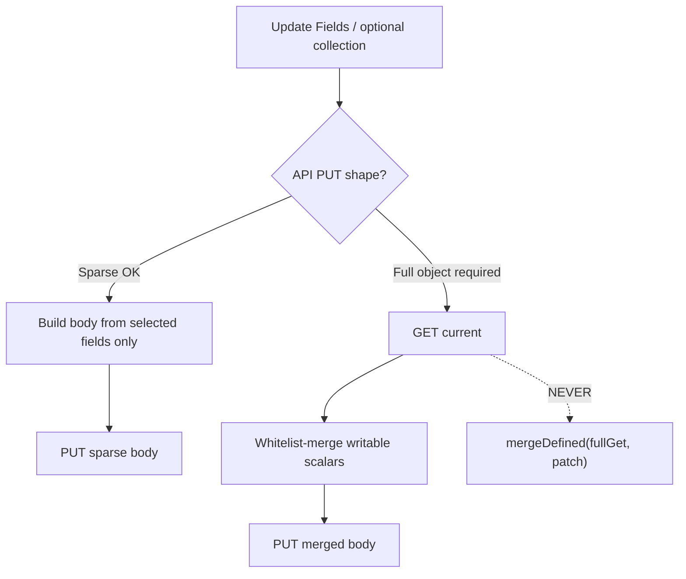

# Research: Suite partial Update — writable field whitelists + n8n Update best practices

**Date**: 2026-07-22T22:23:15+02:00
**Researcher**: Auto
**Git Commit**: 852738901f463d466b89782de4119d6ba82391c5
**Branch**: suite-partial-update
**Repository**: n8n-nodes-nextcloud

## Research Question

For change `suite-partial-update` (roadmap S-09): what fields can we whitelist for safe partial Updates across the full Nextcloud suite, and what do n8n docs (GitBook MCP at `https://docs.n8n.io/~gitbook/mcp`) say about best practices for Update operations like GET → whitelist-merge → PUT?

Scope locked with user: **full suite** + **both** (field inventories and n8n patterns).

## Summary

S-09 needs two complementary patterns, not one:

1. **Full-object PUT APIs** (Deck cards, likely Calendar CalDAV): **GET → whitelist-merge → PUT**. Never `mergeDefined(fullGet, patch)`. Mirror Deck board’s `buildBoardUpdatePayload`.
2. **Sparse PUT APIs** (Files share OCS): **explicit `fieldsToUpdate` / Update Fields collection → body with only selected keys**. GET only for context (e.g. `shareType`), not to rebuild the entity.

n8n docs do **not** prescribe a GET→merge→PUT algorithm. They do prescribe UX: include **Update** in CRUD, put changeable fields under optional collections (`Additional Fields` / **Update Fields**), leave out / simplify confusing API surface, stay consistent with similar nodes (Google Calendar Event Update is the closest first-party UX twin for Calendar).

**Primary in-scope work today:** Calendar event Update (clobbering rebuild) + Deck card Update/Move (`mergeDefined` on full GET). Board Update is already safe. Files share Update is already a sparse-PUT golden path. News mutations are single-purpose endpoints (no multi-field Update). Talk / Tasks / Contacts are not implemented — whitelist stubs only.

## Detailed Findings

### n8n documentation (GitBook MCP + Context7)

Queried live via `https://docs.n8n.io/~gitbook/mcp` tools `searchDocumentation` / `getPage`, plus Context7 `/n8n-io/n8n-docs`.

**What the docs do say (actionable for S-09):**

| Guidance | Source | Implication for suite |
|----------|--------|------------------------|
| Nodes should include CRUD including **Update** | [UX guidelines — Operations to include](https://docs.n8n.io/connect/create-nodes/build-your-node/reference/ux-guidelines) | Keep Update; improve semantics, don’t remove |
| Optional params live in **collection** / Additional Fields; users choose which to set | [Standard parameters](https://docs.n8n.io/connect/create-nodes/build-your-node/reference/base-files/standard-parameters), [Node UI elements — collection](https://docs.n8n.io/connect/create-nodes/build-your-node/reference/node-ui-elements) | Make Update fields optional; empty = keep current |
| Design by asking: what to leave out / simplify / explain | [Node UI design](https://docs.n8n.io/connect/create-nodes/plan-your-node/node-ui-design) | Whitelist = intentional leave-out of read-only/nested API fields |
| Hide optional complexity; only required fields visible on open | Same — “Showing and hiding fields” | Calendar today forces required summary/start/end — fights partial Update |
| Consistency with similar nodes | [UX guidelines — Consistency](https://docs.n8n.io/connect/create-nodes/build-your-node/reference/ux-guidelines) | Align Calendar Update UX with Google Calendar’s **Update Fields** collection |
| Use service GUI terminology; avoid API jargon | UX + UI design | Deck: “archive” not “closed”; CalDAV: user-facing “All Day” not `VALUE=DATE` |
| Don’t mutate shared incoming item data; use built-in HTTP helpers | [Code standards](https://docs.n8n.io/connect/create-nodes/build-your-node/reference/code-standards) | Clone before merge; keep using suite request helpers |

**Google Calendar Event Update (first-party pattern):** [Event operations — Update](https://docs.n8n.io/integrations/builtin/app-nodes/n8n-nodes-base.googlecalendar/event-operations)

- Identity: Calendar + Event ID (+ Modify for recurrence)
- Writable surface under **Update Fields**: All Day, Attendees (add vs replace), Color, Description, End, guest permission flags, Location, RRULE / repeat helpers, Send Updates, Show Me As, Start, Summary, Visibility, …
- Docs point at Google’s `events.update` (full replace on their API) — n8n still exposes **optional Update Fields**, not required re-supply of every property

**What the docs do *not* say:**

- No community-node cookbook for “GET → whitelist → PUT”
- No official denylist/whitelist HTTP payload standard
- Searches for “partial update PUT merge” hit workflow partial *executions* and Merge *node*, not resource Update payloads

**Bottom line from docs:** match **Update Fields / collection UX** and **leave out dangerous API fields**; payload safety is our suite convention (already started with Deck board + Files share).

---

### Calendar (exists — primary S-09 target)

**Current flow:** `eventUpdate` builds a minimal ICS via `buildICalendarPayload` and **PUT**s `{eventId}.ics` — **no GET**, no merge (`nodes/NextcloudCalendar/resources/event/update.ts`). Required UI: `summary`, `start`, `end` (+ optional `description`).

**Risk:** any Update wipes ATTENDEE, RRULE, VALARM, VTIMEZONE/TZID, all-day `VALUE=DATE`, SEQUENCE, ORGANIZER, X-*, and can skew UID (filename `eventId` vs real ICS UID). Parser (`parseIcsEventVerbose`) is read-path only and strips VALARM / omits UID — unsafe as sole merge source.

#### Candidate WHITELIST (user-settable overlay on raw GET ICS)

| Field | Today in Update UI? | Notes |
|-------|---------------------|-------|
| `summary` → SUMMARY | yes (required) | Make optional for true partial |
| `start` → DTSTART | yes (required) | Preserve TZID / VALUE=DATE when not changing |
| `end` → DTEND | yes (required) | Same |
| `description` → DESCRIPTION | yes (optional) | |
| `location` → LOCATION | no (builder supports) | Easy add |

Plausible later (UI + careful emit): `status`, `transp`, `class`, `categories`, `url`, explicit all-day / timezone mode.

Always on write: refresh DTSTAMP; **keep UID from GET ICS**.

#### Candidate EXCLUDE / preserve from raw ICS (do not rebuild from verbose JSON alone)

UID, ATTENDEE, ORGANIZER, RRULE / EXDATE / RDATE / RECURRENCE-ID, VALARM blocks, VTIMEZONE + TZID params, VALUE=DATE, SEQUENCE, CREATED, X-*, unknown props, multi-component structure.

`etag` / If-Match: unused today; optional concurrency later, not a VEVENT whitelist field.

**Design note:** CalDAV needs **ICS-aware** whitelist merge (surgical property overlay on raw calendar-data), **not** JSON `mergeDefined`. No PROPPATCH for event bodies.

---

### Deck (exists — primary S-09 target)

#### Board — already safe

`buildBoardUpdatePayload` → PUT only `{ title, color, archived }` (`nodes/NextcloudDeck/GenericFunctions.ts` ~397–408; `resources/board/update.ts`).

**Whitelist:** `title`, `color`, `archived`.

**Exclude:** `id`, owner object, `labels`, `acl`, `permissions`, `users`, timestamps, settings, nested stacks.

#### Card — unsafe today

`mergeDefined(current, patch)` on full GET (`resources/card/update.ts`). Zod card schema uses `.passthrough()` so nested metadata round-trips into PUT. Same anti-pattern in `moveCard`.

**Candidate WHITELIST for `buildCardUpdatePayload`:**

| Field | In Update UI? | Notes |
|-------|---------------|-------|
| `title` | yes | API-required; keep from current if empty |
| `description` | yes | |
| `duedate` | yes (+ clearDueDate → null) | |
| `type` | hidden; not patched on Update (F1 fixed) | Preserve from current |
| `order` | no on Update | Preserve; Move may set |
| `owner` | no | Only if coerced to **string UID** (GET often returns object → 400) |
| `archived`, `done` | no | Preserve or add UI later; archive also has dedicated routes |

**Labels / assignees:** not PUT body — dedicated assign/remove endpoints. Must **exclude** `labels`, `assignedUsers`, `attachments`, `attachmentCount`, `commentsUnread`, `overdue`, `id`, `stackId` (except Move), timestamps, soft-delete fields.

#### Stack / Label

No Update ops in node. If added later: Stack `{ title, order }`; Label `{ title, color }`.

---

### Files (exists — sparse PUT golden path)

**Share Update** already implements explicit whitelist + sparse body:

- UI: `updateFields` multiOptions — `expireDate`, `password`, `permissions`, `publicUpload` (`nodes/NextcloudFiles/shared/descriptions.ts`)
- Builder: `buildShareUpdateBody` only emits selected keys (`GenericFunctions.ts`)
- GET used for `shareType` sanitization, not full-entity merge (`resources/share/update.ts`)

**Writable whitelist:** permissions, password, expireDate, publicUpload.

**Exclude / create-only:** path, shareType, shareWith, note; response-only id/url/token/owner/etc.

File/folder resources have no multi-field Update (copy/move/upload/delete only).

**Pattern choice:** when API accepts sparse PUT → prefer Files-style `fieldsToUpdate`. When API requires complete object → Deck board-style whitelist-merge from GET.

---

### News (exists — out of S-09 multi-field Update)

Mutations are dedicated endpoints: folder/feed rename, feed move, item mark read/unread/star. No `fieldsToUpdate`, no GET→merge. Item content is feed-derived. **No whitelist work needed** for S-09.

---

### Talk / Tasks / Contacts (not implemented)

| App | Roadmap | Update whitelist status |
|-----|---------|-------------------------|
| Talk | S-05 proposed | Unknown until OCS/Talk API chosen; apply same suite contract when Update lands |
| Tasks | S-11 proposed | Unknown (REST vs CalDAV); if CalDAV, reuse Calendar ICS merge lessons |
| Contacts | S-12 proposed | Unknown (CardDAV vs OCS); CardDAV likely closer to Calendar preserve-unknown-props |

Document stubs in plan; do not invent field lists without API selection.

---

### Shared helpers

`nodes/shared/` has **no** update/merge helpers today. Roadmap unknown remains: shared `build*UpdatePayload` vs node-local convention. Practical recommendation from research: **node-local builders** (Calendar ICS vs Deck JSON vs Files sparse) + a short suite convention note; optional tiny shared `mergeDefined` only for patch overlays, never over raw GET.

## Code References

- `nodes/NextcloudCalendar/resources/event/update.ts` — clobbering ICS PUT, no GET
- `nodes/NextcloudCalendar/GenericFunctions.ts` — `buildICalendarPayload`, `parseIcsEventVerbose`
- `nodes/NextcloudDeck/resources/card/update.ts` — `mergeDefined(fullGet, patch)`
- `nodes/NextcloudDeck/GenericFunctions.ts` — `mergeDefined`, `buildBoardUpdatePayload`, `moveCard`
- `nodes/NextcloudDeck/resources/board/update.ts` — safe board whitelist Update
- `nodes/NextcloudFiles/resources/share/update.ts` — sparse PUT + GET for shareType
- `nodes/NextcloudFiles/GenericFunctions.ts` — `buildShareUpdateBody`
- `nodes/NextcloudFiles/shared/descriptions.ts` — `updateFields` multiOptions
- `context/foundation/roadmap.md` — S-09 outcome / unknowns / risks
- `context/archive/2026-07-18-nextcloud-deck/reviews/impl-review-phase-2.md` — F2 deferral of card whitelist

## Architecture Insights

**Two golden patterns already in-repo:**

1. Deck `buildBoardUpdatePayload` — full-object APIs
2. Files `buildShareUpdateBody` + `updateFields` — sparse APIs

**Anti-pattern:** Deck card `mergeDefined` + Zod `.passthrough()` (intentionally kept metadata for round-trip — exactly what S-09 must stop sending).

**Calendar special case:** merge must operate on **raw ICS**, preserving non-whitelisted lines/components; verbose parse is for Get output, not Update serialize.

**n8n UX alignment:** rename/restructure Update params toward Google-style **Update Fields** collection; stop requiring full re-supply for Calendar.

## Historical Context (from prior changes)

- Deck plan chose GET→merge→PUT because Deck PUT expects a fairly complete object (`context/archive/2026-07-18-nextcloud-deck/plan.md`, `plan-brief.md`).
- Phase 2 impl-review F2: prefer `buildCardUpdatePayload` whitelist over denylist; **SKIPPED** → deferred (originally “S-10”, now **S-09**).
- F1 fixed: don’t force hidden `type: plain` into card Update patches.
- Files share Update shipped as explicit field picker — not framed as S-09 golden path in archive, but code is the suite sparse-PUT reference.
- Context docs do **not** previously cite Google Calendar / Notion Update as merge templates (only trigger patterns in polling research).
- `shared-oauth2-credential` explicitly keeps S-09 out of scope.

## Related Research

- `context/archive/2026-07-18-nextcloud-deck/reviews/impl-review-phase-2.md` — card mergeDefined finding
- `context/archive/2026-07-21-validation-refactoring/research.md` — Files share as validation pilot (related hygiene, not Update merge)
- No prior `research.md` for `suite-partial-update` (this document is the first)

## Open Questions

1. Calendar merge strategy: line/property overlay on raw ICS vs a preserve-unknown serializer?
2. Calendar MVP field set: summary/description/times(/location) only, or also all-day + timezone in the same slice?
3. SEQUENCE / If-Match: in or out of S-09?
4. Does Deck card PUT require owner+type+order every time, or only required keys + changes? (Assume whitelist-from-current until live-proven.)
5. Should `moveCard` share `buildCardUpdatePayload` in the same change?
6. Shared helper under `nodes/shared/` vs documented node-local convention?
7. Talk/Tasks/Contacts: confirm APIs before locking whitelists; Tasks/Contacts may be CalDAV/CardDAV and inherit Calendar preserve rules.
8. UI naming: adopt Google’s **Update Fields** vs keep Deck’s empty-string-means-keep + Additional Fields?
